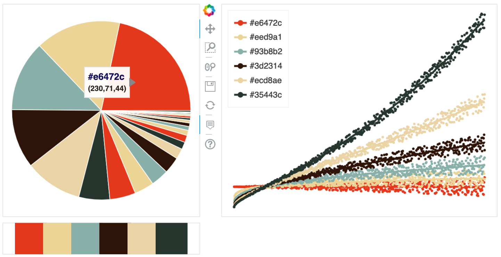
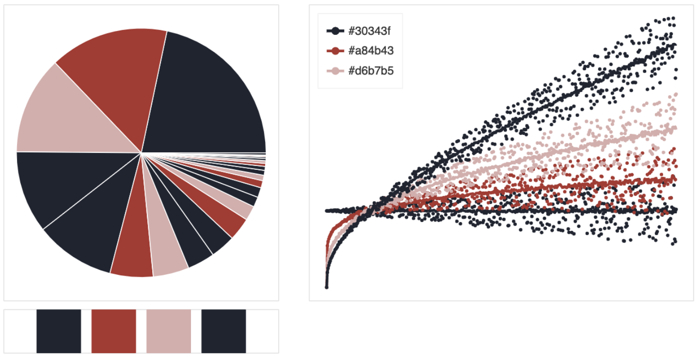
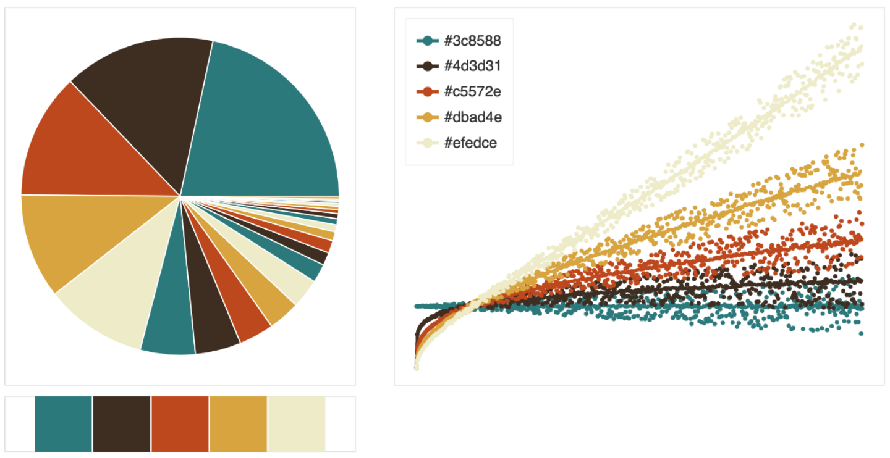

## :art: `palettes.py`
Nice lil home for some custom palettes I've found to be all right.

## :eyes: `viz.py`
(Somewhat) helpful for visualizing how a diverging set of colors would look like on a plot and how they behave in dense vs. scattered visuals. Sometimes colors look great together on a swatch, but not so great in their pointillistic forms. 

Currently there's a limitation to 7 colors (more categorical); I think I want a different kind of format for larger spaces (which tend to be quantitative). 

<ins>lazarus</ins>

*inkling*

**selah**

blonde

honeycombe

crepuscle

