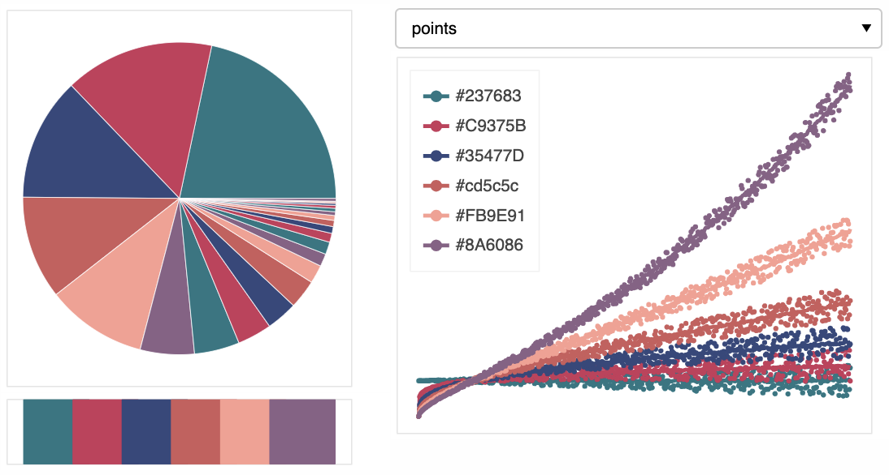

# chromatose

## `palettes.py` :art:
Nice lil home for some custom palettes I've found to be all right. Now pippable!

|       |      |      |      |          |
|----------|----------|----------|----------|----------|
frieda | plath | selah | blonde | honeycombe
crepuscule | leather | gucci | sandbar | fiestaware
chilaquiles | eleven | splenda | gremlin | pollen
medium | juniper | polya | ostrich | fraiche
cheshire | carmine | joan | pinot | addams
minuit | fugazi | clementine | leda | pugsley
bellhooks | wes | lysergic | pepo |  reese
lufte | oolong | pitaya | alice | neko
belle | spiff | yoshi | phoebe | pam
menthol | dwight | riley | mona | eeyore
rainbow

## `viz.py` :eyes:
Somewhat helpful for visualizing how a diverging set of colors would look like on a plot and how they behave in dense vs. scattered visuals. Sometimes colors look great together on a swatch, but not so great in their pointillistic forms. The method's called `palplot`, inspired by seaborn's palplot, but with more functionality (less blurry too).

Currently there's a limitation to 7 colors (more categorical); I think I want a different kind of format for larger spaces (which tend to be quantitative). 

Rough RGB interpolator called `palpolate` (<em>pal</em>-(ette inter)-<em>polate</em>), can handle input lists of any size and user can control output size. Will add HSL/HSV interpolator when I have time.

**frieda**

**plath**

**selah**

**blonde**

**honeycombe**

**lysergic**

**pepo**

**reese**

**rainbow**

**lufte**

**pitaya**

**crepuscule**

**spiff**

**leather**

**eleven**

**chilaquiles**

**fiestaware**

**splenda**

**medium**

**juniper**

**pollen**

**gremlin**

**fraiche**

**polya**

**cheshire**

**carmine**

**joan**

**pinot**

**addams**

**minuit**

**fugazi**

**clementine**

**mona**

**leda**

**pugsley**

**bellhooks**

**oolong**

**alice**

**wes**

**belle**

**neko**

**phoebe**

**pam**

**dwight**

**menthol**

**riley**

**ostrich**

**eeyore**

**yoshi**

**gucci**

**sandbar**

*"The last color she remembered was the indigo chips in the headstone. After that she became as color conscious as a hen."* 
